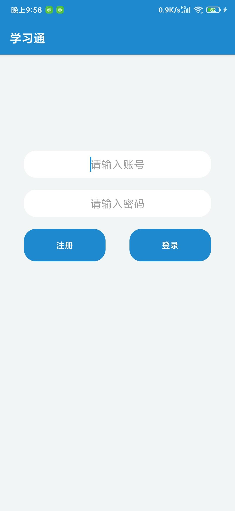
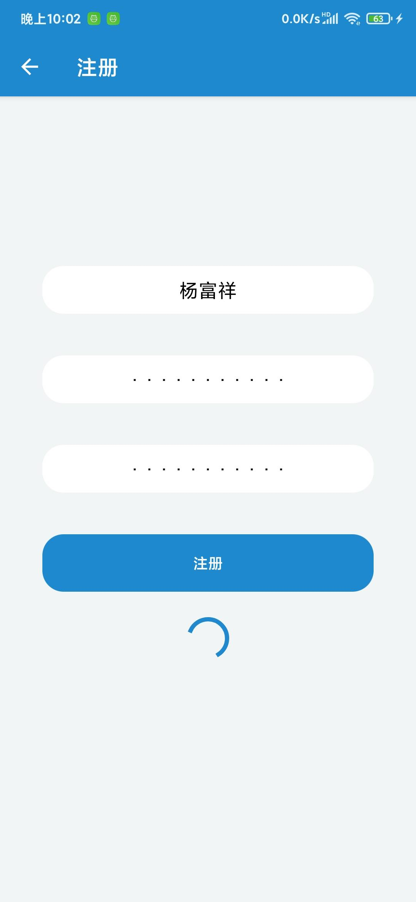
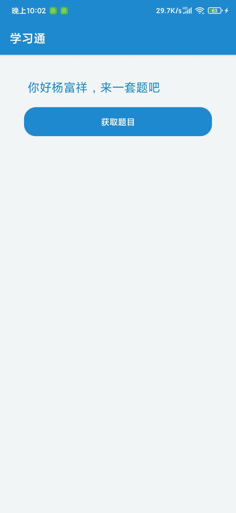
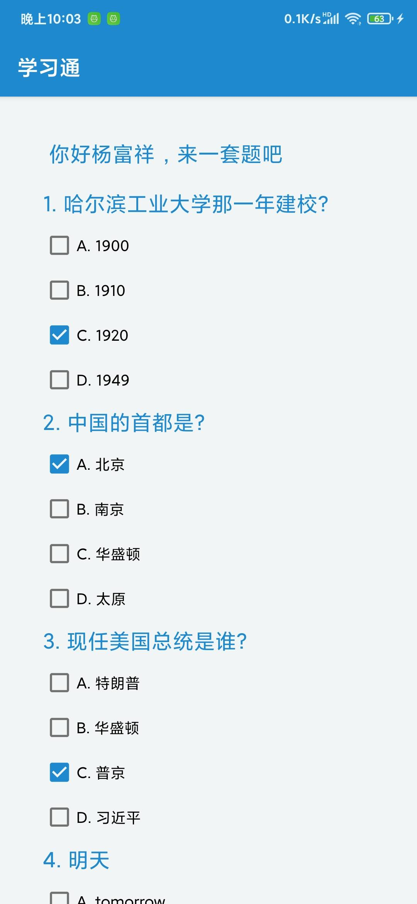
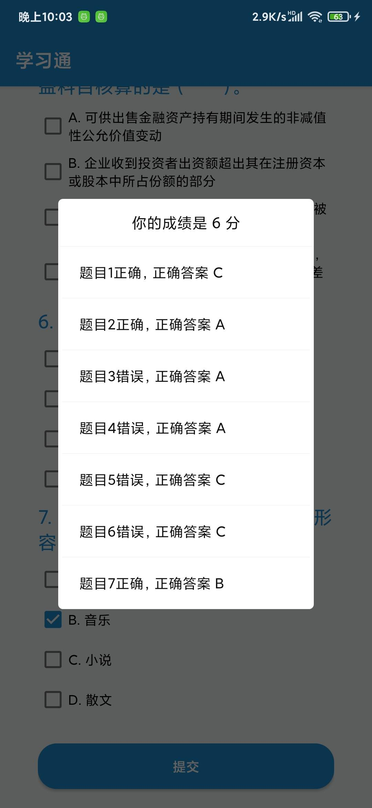

# 哈工大20年东软项目实训前端代码
## 写在前面
- 由于后端服务器已经关闭，所以apk可能无法正常运行，但是所有的布局和代码逻辑都是可以参考的
- 由于疫情原因+考试周，所以留给项目开发的时间比较短，只有1-2天的时间
- 之前曾经使用过java开发安卓项目，所以上手应该比较快
- 肖老师讲课使用的是kotlin语言，感觉比较简单，所以本仓库采用kotlin语言编写
- 前端整体实现思想较为完善，但是部分页面较为简陋，葆有优化的空间
## 整体说明
- 活动：分为登录（入口活动）、注册、答案活动
- 运行截图
  - 登录活动：
  - 注册活动：
  - 获取题目：
  - 填写答案：
  - 答题反馈
  - apk文件[打包的debug.apk](./app-debug.apk)
## 优化空间
- 添加个人信息修改界面
- 添加历史答题数据界面
- 进一步完善提交答案后的反馈界面设计